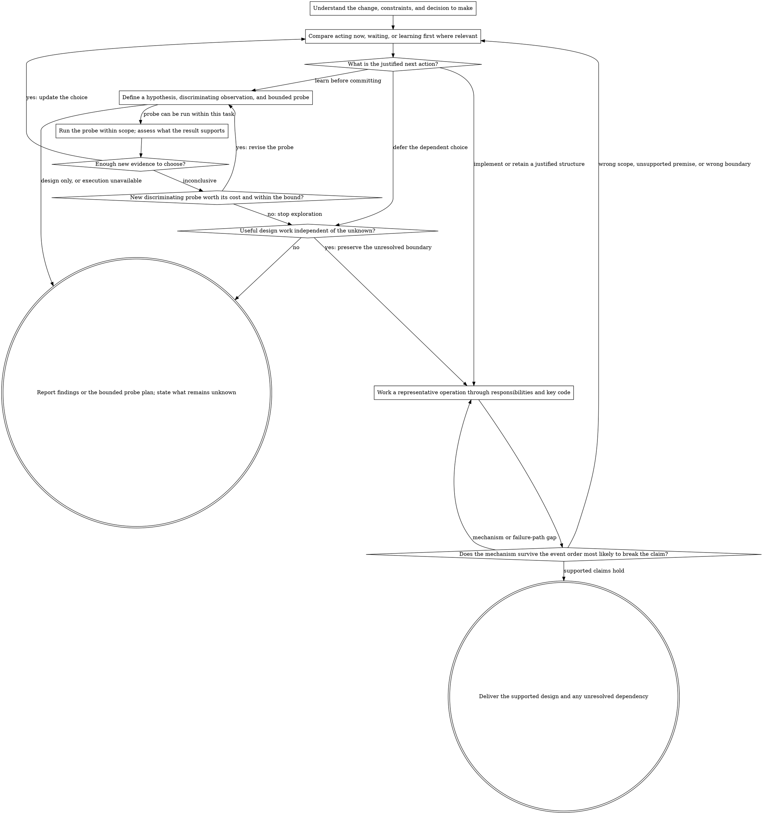

# Code Design

Turn a code requirement or an open question about code structure into a justified next action. Keep useful structure, repair boundaries that obstruct the work, and investigate uncertain directions before committing to them. Judge simplicity across callers, state, operation, and transition costs.

A design response delivers a reasoned choice, concrete responsibilities, and a concrete implementation example of the key mechanism. Code, SQL, configuration, a protocol definition, or labeled pseudocode can provide that example. A design-only request still needs it; it does not require editing a project or claiming execution. An exploration delivers a bounded way to learn and a conclusion supported by what was observed. If implementation is requested, carry the design into the authorized work.

Use the flow to navigate the decision, not as a questionnaire or a required response outline. Scale the investigation and explanation to what could change the choice.

## Core Principles

Use these principles to judge the choices in the process below. When they pull in different directions, resolve the tradeoff from the requirement and its consequences. Naming a principle does not justify a decision by itself.

| Principle | Apply It As |
| --- | --- |
| YAGNI | Defer speculative capabilities. Allow narrow extension points justified by concrete upcoming changes or costly future replacement. |
| KISS | Prefer the simplest design that satisfies the requirement. Count complexity in callers, coordination, and operation as well as implementation. |
| DRY | Consolidate shared knowledge and behavior. Similar syntax alone does not justify merging independent policies. |
| SOLID | Give units a clear responsibility. Support demonstrated variation, preserve substitutable contracts, and keep interfaces focused. Use dependency inversion where it reduces coupling; do not turn these principles into mandatory layers. |
| Separation of concerns (SoC) | Keep presentation, domain rules, persistence, and integration concerns distinct. Follow intentional project boundaries without requiring a separate layer for every concern. |
| High cohesion | Keep behavior and data that change for the same reason together, near their owner. |
| Low coupling | Limit what each module knows about others. Expose narrow contracts and keep implementation details private. |
| Encapsulation | Protect invariants at their owner. Make illegal states hard to represent and internal details safe to change. |
| Composition over inheritance | Prefer focused collaborating parts. Use inheritance when the domain relationship and substitutability support it, rather than merely to share code. |
| Principle of least surprise | Preserve useful local conventions and predictable behavior. Reconsider a convention when its assumptions no longer fit. |
| Proportional commitment | Match the required evidence to the cost, reach, and reversibility of the commitment. Use bounded experiments to learn before making expensive or hard-to-reverse choices. |

## Process Flow

## Frame the Decision

Identify what must change for the user and what is still being discovered. In an existing system, trace the affected operation and inspect its owner. Start with direct callers and follow affected behavior to the relevant contracts, including indirect consumers. A nearby analogous implementation can clarify conventions, but its assumptions must fit this operation. For a new system, start from the behavior and constraints without inventing an existing structure to preserve.

Ask: **What fact would change the decision, and how could we establish it?** Use the implementation, behavior-defining tests, observations, or contracts that answer that question. Keep decisive facts tied to their source and scope; evidence from another operation or project is not a guarantee here. Distinguish observations, structural deductions, and assumptions. Before another investigation, identify how its result could change the choice or test a consequential claim. If it can do neither, proceed with the supported work.

Uncertainty about a requirement or a technology may justify learning before architecture. State a falsifiable hypothesis and the observation that would support or challenge it. Choose the least costly probe that can distinguish the credible alternatives. Bound the effort by the loss the probe could help avoid, its ability to distinguish alternatives, and the time available. Stop when the decision has enough support or the bound is reached. Quantify only where the measures have meaning; do not invent percentages to make a hypothesis look rigorous.

A probe may support, contradict, or leave a hypothesis unresolved. Reaching the bound does not prove the idea wrong. Report what was learned and whether to commit, change the probe, or defer. Extend exploration only when a new discriminating observation is worth the additional effort; repetition or lack of a counterexample alone is not progress. Keep experimental effects contained and promotion into maintained code explicit. A parallel implementation is useful only when its benefit justifies maintaining both paths. A probe proposal is not an observed result, and evidence for a small prototype does not establish production-scale guarantees.

## Choose the Commitment

Compare the credible actions that could resolve the decision: change now, retain or defer, or obtain more information first. A routine local change need not manufacture three alternatives. Ask what each action leaves unresolved, what burden it introduces, and which future choices it preserves or closes.

Inspect the cost of keeping the structure as well as changing it. Copied rules, repeated workarounds, incidents, or recurring coordination can justify moving a boundary now. If the existing approach meets the constraints, identify an additional concrete benefit before replacing it. Judge reversibility by the recovery work: who must cooperate, and can data, external consumers, and completed effects be restored? Reverting code alone may not restore the system. Include compatibility and release constraints where they affect that recovery. Neither fewer changed lines nor a newer architecture establishes simplicity.

Consider the cost of waiting. A committed change, repeated history, or a structural constraint can justify preparing before the change arrives. Explain which recovery conditions or affordable choices waiting could remove, and which assumptions support that forecast. Weigh that against the learning gained by waiting and the continuing cost of the preparation. Estimates may be qualitative or ranges; unsupported precision is not stronger evidence.

For a proposed extension point, ask: **Which particular future change becomes cheaper, and what must today's callers pay for it?** Choose the smallest useful arrangement that preserves that option. A focused function or a concrete component may already suffice. A speculative parameter, extra implementation, or framework is not justified merely because it is cheap to add. Reconsider the arrangement when its premise changes; retain it if it still serves a current responsibility, rather than deleting it on an arbitrary expiry date.

For an abstraction, identify the shared knowledge, real variation, or external effect it contains. Move shared rules to their actual owner instead of leaving duplicate implementations behind a wrapper. Preserve independent policies where they differ; separate feature names or contracts alone do not prove a variation point. Caller count neither requires nor forbids a boundary.

Include refactoring needed to fulfill the requirement when a misplaced rule or broken boundary is the cause. Preserve public contracts unless their change is in scope. Distinguish structural changes from intended behavior changes when useful for review. Stage a transition only where each stage leaves a valid system, and leave unrelated cleanup out.

## Work Through the Operation

Choose a representative operation that exercises the decisive behavior. Follow it from entry to observable result. Place rules and state along that path: who calls whom, who may change a value, and who owns a resource through its lifetime. Define contracts for errors, absent values, and fallback behavior where they affect the caller. Name responsibilities rather than relying on generic managers or helpers.

Keep durable business rules independent of presentation and transport details where the project allows. Translate external formats at the integration boundary. Use focused access to contain storage details when it helps callers; do not create parallel repository layers for symmetry. If testing the behavior requires unrelated UI, network, clock, or storage setup, inspect the dependency direction and separate real external effects without making every unit an interface.

Reason separately about **responsibility, resource lifetime, and physical isolation**. Features can own their policies while sharing infrastructure. A shared resource can have one lifecycle owner and narrow access surfaces; application scope does not require unrestricted global access. Choose physical separation from the guarantees it provides, including the coordination it adds. Keep cross-feature invariants with the operation that owns them.

Write the key behavior as you work through this operation. Make the consequential rule, state change, or ordering visible in code, SQL, configuration, or labeled pseudocode. Ordinary dependencies can be omitted, but a signature, comment, or unexplained helper cannot stand in for the behavior being designed. Use real project APIs when known. At an unknown contract, keep both the decision and the example within what is known. Show supported behavior or a concrete probe. If production behavior depends on a missing fact, make that dependency conditional in the implementation too; an earlier caveat does not justify guessed semantics later.

Check the example against its central promise. Trace the event order most likely to break it, especially across interruption, cancellation, concurrency, or retry. Follow the actual state changes: what can resume, which result can still be accepted, and what survives? Confirm that the protecting mechanism takes effect before the harmful event. A coordinator name or a comment saying "atomic" does not provide that protection. Repair a counterexample before presenting the design. Extend the check where another consequential mechanism needs its own evidence.

For migrations and contract transitions, identify the authoritative state at each stage and account for concurrent activity. A rollback plan must cover changes made after switching over. Choose a transition that fits the actual availability constraint. If the mechanism cannot fulfill the claim, revise the design or narrow the claim to the supported outcome.

Verify with a representative workload, failure exercise, or contract check according to what could invalidate the choice. Use existing project tools without creating a generic test program for every change. Apply measurements only to the implementation and workload they describe. Operation count, capacity, and elapsed time establish different things; after changing the mechanism, verify the new path before claiming its performance. In design-only work, specify the necessary check and leave its result unverified.

## Deliver the Decision

For a design, explain the **reason for the change, meaningful comparison, decision, concrete architecture, and implementation example** in that order. Identify the decisive constraint and explain why it favors this choice. Compare differences that could change the decision. Each part should prepare the reader for the next, without mandatory headings or repeated conclusions. For a tiny edit, a short explanation and the changed code can do this work.

For exploration, present the question, hypothesis, bounded probe, observed evidence if any, and its implication for the next action. Do not force an unresolved exploration into a final architecture. Continue useful design work independent of the unknown, and distinguish that supported portion from the choice still deferred.

Explain one complete main path before its qualifications. State when an alternative becomes appropriate instead of leaving several options for the reader to resolve. Use short sentences with explicit subjects and give each paragraph one explanatory purpose. Explain unfamiliar terms where they carry the choice. If space is limited, remove repeated reasoning and secondary branches before cutting the decisive mechanism. Format code so state changes and control flow remain easy to follow.

Use a relationship diagram when it clarifies ownership or dependencies, a flowchart for branching, or a sequence diagram for interaction order. Label the connections and use the same roles, states, and operations across prose, diagram, and code. Let each contribute information instead of repeating the same content three times. A small local design may need no diagram.

Finish when the supported choice, responsibilities, and visible mechanism agree, with consequential unknowns still explicit. For a completed probe, finish with its evidence and conclusion within the agreed bound. Report what was actually implemented or verified separately from proposals. Do not substitute a design essay for authorized implementation work.
