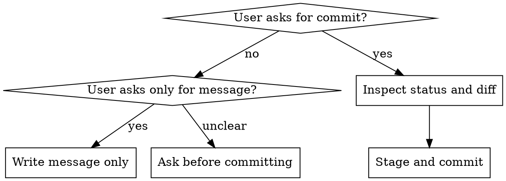

# Git Commit

## Overview

Create commits that are safe, reviewable, and useful later across any Git repository. The core rule is: inspect before staging, stage only the intended changes, verify what matters for this project, then write a clear commit message.

When writing or reviewing a commit message for already staged changes, analyze only the staged diff. Use the existing staging workflow below when the user asks you to create a commit or decide what to stage.

## Decision Rule



If the user asks for a message, do not run `git commit`. If the user asks to commit, commit only after inspection and relevant verification.

## Workflow

1. Run `git status --short`.
2. Inspect relevant changes with `git diff`, `git diff --staged`, or path-specific diffs.
3. Separate task changes from pre-existing or unrelated user changes.
4. Run the atomic commit check. If changes are loosely related or too complex for one clear subject, propose a split commit plan before staging.
5. Choose verification based on changed files. Run it when practical; if skipped, record why.
6. Stage only the intended paths. Prefer explicit paths over `git add .`.
7. Re-check `git diff --staged --stat` and, when useful, `git diff --staged`.
8. Commit with a clear subject, using Conventional Commits by default unless the repository uses another convention. Use additional `-m` bodies when the why is not obvious.
9. Report subject, staged scope, verification run, and any skipped checks.

## Staged Message Workflow

Use this stricter workflow when the user asks for a commit message for staged changes, asks to review a staged commit message, or staged changes already exist:

1. Run `git status --short`.
2. Run `git diff --cached` and analyze only the staged diff.
3. Ignore unstaged working tree changes when generating the message. Mention them only if they create risk for staging or committing.
4. If the staged diff is empty, stop and say there are no staged changes.
5. If the staged diff mixes unrelated intents, propose a split before generating one message unless the user explicitly asked for a single commit.
6. If you are uncertain about the staged change's meaning or cannot summarize it accurately, ask before guessing. Give exactly three possible interpretations labeled `1`, `2`, and `3`, and ask the user to choose or provide the correct meaning.
7. Generate the message, then wait for user review before committing unless the user has already clearly asked you to commit after inspection.

For staged message generation, use this format by default:

```text
<type>(<scope>): <summary>

- <detail>
- <detail>
```

## Atomic Commit Check

A good commit should express one coherent intent. Before staging, ask whether the whole diff can be described by one clear subject without using "and", "also", "misc", or vague grouping words.

Propose splitting when:

- Changes serve multiple purposes, such as docs plus feature work plus dependency updates.
- Multiple strong commit types apply, such as `feat` and `fix`, or `docs` and `refactor`.
- File groups are independent and could be reviewed, tested, or reverted separately.
- Different parts require different verification strategies.
- The subject would become vague, overly broad, or hard to keep concise.
- Reviewers would need to understand unrelated topics in one diff.

Keep together when:

- Source changes and generated outputs belong to the same change.
- Tests document the same behavior as the implementation.
- Documentation explains the same feature or fix.
- Small formatting, renaming, or cleanup is inseparable from the current change.
- Splitting would create commits that do not build, do not pass tests, or are misleading alone.

When splitting is appropriate, stop before staging and propose a commit plan with subjects, file groups, and the reason for the split. Ask for confirmation unless the user already requested that exact split. If the user explicitly wants one commit, obey only after confirming no unrelated user changes are included.

## Message Format

Use Conventional Commits by default unless the repository has a different established convention:

```text
<type>(<scope>): <summary>

<body>

<footer>
```

Rules:

- The subject summarizes what the commit is and what it does. It is not a reproduction step, file-by-file diff, command log, or implementation narration.
- Match the commit message language to the repository, team, and user context. If recent high-quality commits are Chinese, write Chinese; if they are English, write English; if the user specifies a language, follow it. Ignore old low-quality commits.
- Summary is imperative when writing English; for Chinese, use concise verb-object or result-oriented phrasing. Avoid trailing punctuation in either language.
- Keep the first line concise, ideally under 72 characters, but prefer clarity over artificial compression.
- Body explains intent, context, and consequences. It may mention key details, but should not mechanically replay the diff.
- Use `BREAKING CHANGE:` in the footer or body for breaking behavior.
- Use footers such as `Refs:` or `Closes:` only when there is an actual issue or reference.
- For Chinese commit messages, avoid filler or praise words such as `优化`, `提升`, `改善`, `方便`, `增强`, and `更语义化`. State the concrete behavior, problem, or outcome directly.
- Avoid implementation narration in the summary and body, such as `使用 X 替代 Y`, `添加参数 Z`, `调用方法 A`, `修改 XX 类的 YY 方法`, unless the commit is `chore` and the implementation detail is the actual maintenance subject.
- Merge multiple small code-level edits into one user-facing, bug-level, architecture-level, or toolchain-level detail. Do not list tiny refactors separately when they only support the same change.

## Type And Scope

| Type | Use For | Avoid |
| --- | --- | --- |
| `feat` | User-visible capability or product behavior | Internal wiring with no new capability |
| `fix` | Bug fix | General cleanup or unrelated hardening |
| `docs` | Documentation-only changes | Code comments that accompany behavior changes |
| `style` | Formatting with no behavior change | UI styling or design changes; those may be `feat`/`fix` |
| `refactor` | Behavior-preserving code restructuring | Any behavior change |
| `test` | Tests only or test infrastructure | Feature work that happens to include tests |
| `build` | Build system, packaging, compiler, bundler, artifact, or build config changes | Ordinary dependency declaration or lockfile maintenance |
| `ci` | CI pipeline configuration | Local build scripts unless they are CI-specific |
| `chore` | Maintenance, repo housekeeping, dependency updates | User-visible behavior changes |
| `perf` | Performance improvement | Refactors with no measured or intended performance effect |
| `revert` | Reverting a previous commit | Follow-up fixes that are not actual reverts |

Choose scope by the change's real subject, not by the path or a tool mentioned in the diff. Prefer, in order: user-facing domain, product/document topic, subsystem/module, cross-cutting category (`deps`, `ci`, `release`). Omit scope when it adds noise.

For `docs`, scope should answer what the document is about, not what tool appears in the text. `docs(agents)`, `docs(prd)`, `docs(architecture)`, or `docs(planning)` are often better than naming an incidental tool.

For Chinese app/product commits that use only `feat`, `fix`, `refactor`, and `chore`, apply these rules:

| Type | Use For |
| --- | --- |
| `feat` | New user-visible capability or product behavior |
| `fix` | Bug fixes, UI corrections, copy corrections, and small behavior or code adjustments that do not change architecture |
| `refactor` | Large restructuring, architecture changes, module boundary changes, or low-level rewrites without intended behavior change |
| `chore` | Build process, dependency updates, tooling, generated maintenance, or auxiliary configuration |

Important type decisions:

- Use `fix` for small code-detail changes, variable renames, method call replacement, display adjustments, and non-architectural corrections.
- Use `refactor` only for broad restructuring, architecture changes, or module structure changes.
- Use `chore` for build and tooling changes. `chore` may describe technical details such as SDK, NDK, Gradle, dependency, or script versions, but each body bullet must state the affected scope, such as all modules, Android only, iOS only, or the build process.

Scope rules:

- Choose a broad functional module such as `purchase`, `auth`, `home`, `food`, `media`, or `profile`.
- Do not use overly specific class, file, method, widget, or helper names as scopes.
- Merge multiple changes in the same functional module under one scope when they share one intent.

Examples:

```text
docs(agents): refine repository agent instructions
feat(auth): add password reset flow
fix(api): handle empty search results
chore(deps): update dependencies
docs(agents): refine agent collaboration guidance
fix(login): fix expired verification code prompt
```

Bad -> better:

```text
Bad: prd: 11
Better: docs(prd): add runtime logic requirements

Bad: build(deps): mark async, clock, collection, and fake_async as direct dependencies
Better: chore(deps): update dependencies

Bad: docs(superpowers): add V1 runnable closed-loop design and Superpowers constraints
Better: docs(architecture): add V1 runnable closed-loop design
Better: docs(agents): update agent execution constraints

Bad: fix(router): change framework.dart export path to avoid wrong module path
Better: fix(router): correct router export entry
```

## Chinese Detail Rules

When writing Chinese body bullets:

- Start each bullet with `- `.
- Describe functional details, bug details, refactor details, or toolchain details.
- Do not describe code mechanics, except for `chore` technical version/config details.
- Do not use filler or evaluative words such as `优化`, `提升`, `改善`, `方便`, `增强`, or `更语义化`.
- Combine repeated edits for one function into one bullet.
- Do not list small code-level refactors as standalone bullets.

For UI changes, be specific:

- Name the mode or view, such as `列表模式`, `分组模式`, `详情页`, or `主页列表`.
- Name the UI elements involved, such as `食物名称和标签间距` or `按钮和输入框间距`.
- Describe the problem or concrete change directly, such as `颜色不响应`, `间距过大`, or `显示样式居中`.

Good:

```text
fix(home): 调整列表模式食物名称和标签间距

- 调整列表模式食物名称和标签间距
- 修复主页列表餐食标签颜色不响应
```

Bad:

```text
refactor(purchase): 优化购买页面翻译键名和折扣显示样式

- 使用 appTheme 替代 UseAppTextStyles 统一样式管理
- 为折扣标签添加行高样式以优化显示效果
```

Before presenting a generated message, check:

- Only staged changes from `git diff --cached` are included.
- The type matches the change, especially `fix` versus `refactor`.
- The scope is a broad module, not a specific file or implementation detail.
- The summary has no filler or evaluative words.
- Body bullets have no implementation details, except allowed `chore` details.
- Body bullets have no filler or evaluative words.
- Related edits are merged into one bullet.
- Small code-level changes are not listed separately.
- `chore` bullets state affected scope.
- UI bullets name the mode/view and concrete UI elements.

## Style Detection

Inspect recent commits and repository docs, but separate current convention from historical noise. Prefer the most recent high-quality pattern over old initialization or placeholder messages.

High-quality examples usually have a meaningful type, accurate scope, concrete subject, and optional body that explains intent. Do not imitate messages like `init`, `update`, `misc`, `prd: 11`, `fix stuff`, `tweak`, or `fix issues`.

Before committing, be able to justify:

- Type: why this type matches the nature of the change.
- Scope: what domain, topic, or subsystem the change is actually about.
- Subject: how it summarizes the commit rather than replaying the diff.
- Rejected alternatives: any tempting but wrong type/scope you avoided.

## Staging Rules

- Prefer `git add path/to/file` for known files.
- Avoid `git add .` in a dirty worktree unless every changed file was inspected and belongs in the commit.
- Never stage unrelated user changes to make the tree clean.
- Include generated files only when they are the expected output of source changes.
- If the staged diff contains unrelated work, unstage before committing.

## Verification Rules

Pick checks that match the repository and change. Prefer commands documented in `README`, `AGENTS.md`, package manifests, CI config, Makefiles, or prior project instructions. Common patterns:

| Change | Typical Check |
| --- | --- |
| Docs only | Read Markdown; verify paths, anchors, and examples |
| Application/library code | Project formatter, linter/typecheck, and relevant tests |
| UI changes | Component/widget tests, screenshots, or manual visual check when available |
| Generated code | Run the generator from source inputs, then review generated diff |
| Dependencies/build | Install/update command, lockfile review, build or smoke test |
| CI/config | Syntax validation or the narrow command affected by the config |

Do not assume a language or framework. Infer checks from the repo. Do not claim checks passed unless you ran them and read the result. If a check is too expensive, blocked, or irrelevant, say so in the final report.

## Red Flags

Stop and reassess when you notice:

- You are about to use `git add .` without reviewing every changed file.
- The user asked for a commit message only.
- `git status --short` shows files unrelated to the current task.
- One staged commit would combine loosely related changes that deserve separate review or rollback.
- The subject is vague: `update`, `changes`, `fix stuff`, `misc`, `tweak`, or only a ticket/number.
- You are committing generated files without their source changes.
- You are skipping an obvious verification step just to finish faster.
- You are writing English in a repo whose recent high-quality commits are Chinese, or Chinese in a repo whose recent high-quality commits are English, without a reason.
- You are copying old bad commits instead of identifying the current convention.
- The subject describes implementation mechanics or reproduction steps instead of summarizing the commit.
- Body text contains literal `\n` instead of real newlines.
- You are about to amend, reset, rebase, or force-push without explicit user instruction.

## Common Mistakes

| Mistake | Fix |
| --- | --- |
| Committing unrelated dirty work | Stage explicit paths and re-check staged diff |
| Combining unrelated purposes | Propose an atomic split plan before staging |
| Overly broad type like `chore` for behavior | Use `feat` or `fix` when users can observe it |
| Wrong type like `build` for routine dependency updates | Use `chore(deps)` unless build tooling actually changed |
| Scope copied from incidental tool or path | Use the actual domain, document topic, or subsystem |
| Subject repeats implementation details | Summarize the commit intent and outcome |
| Body repeats file list | Explain intent, tradeoffs, and why |
| Breaking change hidden in body | Add `BREAKING CHANGE:` footer |
| Commit made before verification | Run relevant checks first, or state why not |
| Message language clashes with repo history | Inspect recent commits and match the established language |
