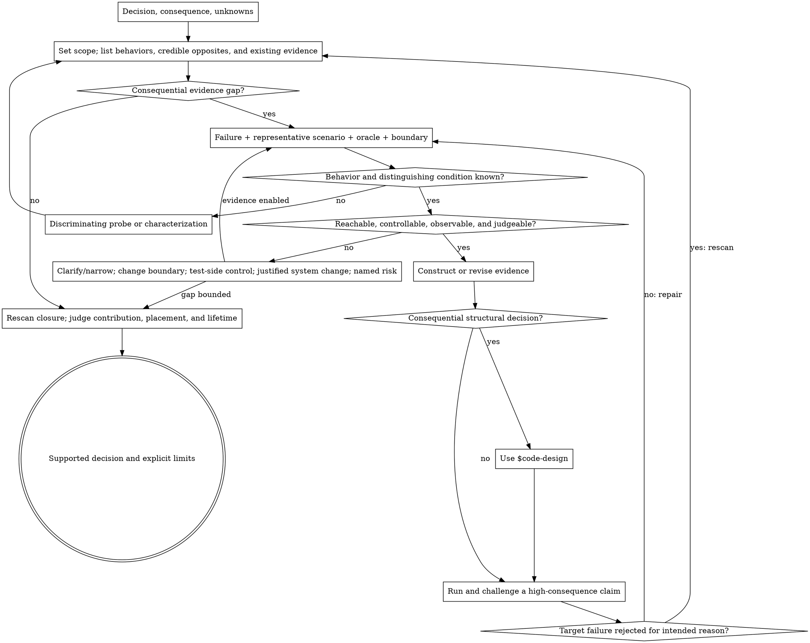

# Test Design

## Overview

Answer five questions:

1. **What must the evidence establish?**
2. **Which failure must it reject?**
3. **Which scenario, oracle, and boundary can prove that?**
4. **What is missing when trustworthy evidence is hard to obtain?**
5. **Does the finished test still add distinct value to the suite?**

**Core principle: tests protect behavioral contracts that users and callers can observe. Coverage and internal call shape do not define test value.**

A valid result may add, strengthen, move, combine, or retire a test; run a bounded probe; change a test boundary; justify a testability change; rely on another control; or leave a named risk.

## When to Use

- Writing or changing tests for behavior, defects, refactoring, compatibility, or release
- Reconstructing unclear behavior or diagnosing an uncertain failure
- Deciding unit, integration, contract, end-to-end, or live evidence
- Making difficult code testable with minimum lasting impact
- Reviewing test effectiveness, coverage contribution, duplication, flakiness, placement, or retirement
- Designing shared test infrastructure or production observability

**Do not invoke for merely running a known test command or reporting an already-understood failure.**

## Three Laws

1. **Closure:** complete-contract work accounts for every normative behavior; targeted work accounts for the target, adjacent boundaries, and affected invariants. Each has trusted evidence, new evidence, another effective control, or a named gap.
2. **Support:** a test uses a reachable witness and an independent oracle; its conclusion is no stronger than its boundary.
3. **Sensitivity:** every retained behavior names the test that rejects its credible opposite; high-consequence claims are challenged in practice. A green suite alone proves none of these laws.

## Workflow

1. **Frame the decision:** purpose, consequence, unknowns, and authority (§1).
2. **Write the behavior list:** map each in-scope condition or history to its observable result, credible opposite, and evidence disposition (§1).
3. **Choose cases:** close applicable partitions, boundaries, exclusions, combinations, and histories; consolidate only afterward (§2).
4. **Choose proof:** supported witness, independent oracle, and least-cost faithful boundary (§3).
5. **Resolve uncertainty or testability:** probe unclear behavior; diagnose missing stimulus, control, observation, oracle, isolation, ownership, or infrastructure (§4–§5).
6. **Construct evidence:** write or revise tests and make only justified system changes.
7. **Challenge it:** run focused and standard lanes; attack a high-consequence claim (§7).
8. **Judge the portfolio:** rescan closure, distinct contribution, feedback, placement, cost, and lifetime (§8).

## Process Flow



## §1 Frame the Decision and Close Claims

Choose the evidence purpose:

| Purpose               | Completion signal                                                      |
| --------------------- | ---------------------------------------------------------------------- |
| Learning              | An observation separates alternatives and changes the next action.     |
| Diagnosis             | The symptom is reproduced or credible causes are distinguished.        |
| Protection            | A decided behavior rejects a credible regression.                      |
| Refactoring           | Relied-on behavior is preserved without locking internal structure.    |
| Compatibility/release | The required versions, boundary, and environment support the decision. |
| Suite engineering     | Future feedback becomes more trustworthy, timely, or economical.       |

Inspect requirements, public interfaces, callers, schemas, runbooks, implementation, existing tests, types, constraints, incidents, and operational evidence. Keep sources attached to claims:

- **Approved behavior** can define protection.
- **Current behavior** can support characterization.
- **Caller reliance** may constrain a change without making it approved.
- **One observation** supports only its exercised conditions.
- **Assumptions** remain gaps until resolved or accepted bounded.

Set the scope before selecting cases:

- **Complete contract:** account for every normative behavior in the requested contract, including validation, exclusions, precedence, and public result mapping.
- **Targeted change or regression:** account for the target behavior, adjacent boundaries, affected callers, and invariants the change could plausibly break.

Write an internal behavior list from those sources before reading implementation branches as case suggestions:

```text
condition or history -> caller-observable result -> credible opposite -> evidence disposition
```

A behavior matters when it is normative in complete-contract scope, or when violating it can change an observable result, corrupt state, misbind identity, bypass a rule, break compatibility, prevent recovery, or invalidate the targeted decision.

Assign every in-scope behavior one disposition:

```text
trusted existing evidence | new/strengthened evidence | another effective control | named gap/accepted risk
```

The list is a closure map, not a required response table or one-test-per-sentence rule. Do not declare sufficiency while an in-scope behavior has silently disappeared.

Trace selected claims through callers. Include a caller or adapter when it maps errors, changes identity or event order, reinterprets a result, bypasses a rule, or creates a distinct public outcome.

## §2 Choose Representative Cases

Start from the behavior list and credible opposites, not source branches. Establish case obligations before optimizing test count.

| Failure shape                         | Case-selection move                                                                                                                                       |
| ------------------------------------- | --------------------------------------------------------------------------------------------------------------------------------------------------------- |
| Independently validated field or enum | Cover a valid representative and each materially distinct rejected partition; share evidence only when the same validator and failure meaning are proven. |
| Semantic groups                       | Use one representative per distinct behavior and rejected equivalence class.                                                                              |
| Threshold or interval                 | Cover each normative boundary, exact equality when inclusion matters, and representatives from both behavioral sides.                                     |
| Half-open window                      | Cover the included start, excluded end, and the relevant inside/outside classes.                                                                          |
| Eligibility or exclusion              | Cover an eligible case and every independent exclusion that protects a distinct rule.                                                                     |
| Interacting conditions                | Cover each rule alone plus precedence, masking, or “several true”; use pairwise or risk selection when large.                                             |
| Stateful behavior                     | Legal path plus applicable illegal transition, repetition, idempotency, retry, or prior history.                                                          |
| Broad invariant                       | Use properties or generated cases with a useful shrinking and diagnosis strategy.                                                                         |
| Escaped defect                        | Preserve the minimal causal incident and its observable harm.                                                                                             |
| Public input risk                     | Add relevant empty, wrong-type, malformed, oversized, or hostile representatives.                                                                         |

Only consolidate after every applicable obligation has evidence. Combine or parameterize cases when they share the same rule, causal history, expected result, and diagnostic meaning. Keep decisive inputs and expected outcomes visible. Similar exception types alone do not make cases equivalent.

For fallible effects, distinguish applicable result classes: success, definite failure, uncertain failure such as lost acknowledgement, unexpected exception or malformed result, and interruption or partial completion.

For each materially different class, decide the required state, permitted effects, retry behavior, diagnostic evidence, and recovery owner. Do not infer one result class from another.

When identity controls authorization, ownership, idempotency, deduplication, or correlation, vary the relevant dimensions: same identity and intent, the same identity across a fresh lifecycle, the same identity with changed intent, different scoped identities sharing a local value, and component values that could collide after encoding.

UI, security, performance, compatibility, time, and concurrency change the environment and oracle. Use user-perceivable interaction, trust and abuse paths, representative workload, supported version histories, controlled clocks, or contested schedules when those mechanisms create the risk.

## §3 Choose Witness, Oracle, and Boundary

Use this evidence chain:

```text
claim -> credible failure -> causal path -> stimulus/control -> observation/oracle
```

### Supported witness

Reach the decisive condition through public input, documented configuration, legal prior state, or a real collaborator response.

- A private constant edit proves only a local mechanism.
- Bypassing validation cannot prove the public contract.
- An impossible state cannot establish caller-visible behavior.
- No supported witness → clarify, narrow, choose a legitimate lower boundary, justify a product capability, or name the gap.

### Independent oracle

Prefer:

1. return value or typed error;
2. observable state or durable invariant;
3. externally meaningful effect or public protocol result;
4. interaction/order only when collaboration is itself the claim.

Hand-derive expected values. Do not reuse the production algorithm in the assertion. Assert enough to prove one complete outcome; split independent failures when they need different histories or diagnosis.

### Faithful boundary and test doubles

Choose the least costly boundary that still contains the target failure mechanism. For every substitute, name what it removes.

- Use a real lightweight dependency, emulator, or contract environment when transaction, protocol, process, scheduling, persistence, platform, or resource behavior creates the risk.
- Otherwise prefer **faithful Fake > Recording Fake / contract replay > Spy > expectation-heavy Mock**.
- Use a fake to model stable behavior and state; use recording when arguments, order, or state at the call matters; use replay to protect an agreed protocol; use spies or mocks for narrow control or observation.
- Assert contract-visible result and shape. Internal call counts matter only when count or order is the contract.

Mock count is a boundary warning, not a quota. A simple fake does not outrank a real boundary when it removes the failure being tested.

| Claimed conclusion    | Required boundary evidence                                     |
| --------------------- | -------------------------------------------------------------- |
| Local rule is correct | Execute the real rule with an independent oracle.              |
| State was committed   | Observe the transaction or persisted state.                    |
| Durable/restart-safe  | Close and reopen, or cross an equivalent lifecycle boundary.   |
| Cross-process         | Exercise an independent process or an equivalent mechanism.    |
| Provider accepted     | Observe provider or agreed protocol acceptance.                |
| Effect completed      | Observe the final effect; sending or queuing is insufficient.  |
| Recovery works        | Create the failure history and execute the real recovery path. |

Coverage locates unexecuted structure. It does not replace claim closure or oracle sensitivity.

## §4 When Behavior or Cause Is Unclear

Separate uncertainty about approved behavior, current behavior, caller or stored-data reliance, causal history, boundary ownership, and evidence adequacy.

Write alternatives that imply different actions. Predict the distinguishing observation. Run the smallest authorized probe that can separate them.

- **Exploration:** discard when the decision is made.
- **Characterization:** records current behavior; give it a promotion, review, or removal trigger.
- **Diagnostic reproducer:** separates causes; convert it to protection only when recurrence remains consequential.
- **Unresolved claim:** name the missing authority or observation; do not convert uncertainty into an accidental contract.

Stop when evidence supports the decision, another observation would not change it, the agreed bound is reached, or the remaining step needs unavailable authority or unacceptable effects.

## §5 When the System Is Hard to Test

Name the missing capability before proposing a seam:

| Gap            | Question                                                                                          |
| -------------- | ------------------------------------------------------------------------------------------------- |
| Stimulus       | Can supported behavior reach the condition?                                                       |
| Control        | Can time, identity, state, dependency response, failure, or order be established?                 |
| Observation    | Can the meaningful result be distinguished from an intermediate signal?                           |
| Oracle         | Is acceptable behavior defined well enough to judge?                                              |
| Isolation      | Can state and effects avoid cross-test interference?                                              |
| Ownership      | Does one coherent boundary own the rule and outcome?                                              |
| Infrastructure | Is a faithful environment, driver, resource, fault control, or synchronization mechanism missing? |

Compare solutions in order of lasting burden: existing public capability, a test-side driver or controlled resource, another faithful boundary, a production-meaningful system change, then an explicit bounded risk.

Judge evidence gained, semantics, callers, operational value, maintenance, and reversibility. A useful system change exposes a real dependency, identity, status, event, completion condition, or responsibility used by production and tests.

Reject test-only branches, invalid-state setters, private-representation getters, duplicate workflows, and interfaces created solely to mock one implementation.

## §6 Use `$code-design` for Test Architecture

| Invoke `$code-design`                          | Handle locally                                       |
| ---------------------------------------------- | ---------------------------------------------------- |
| Shared fixtures, builders, fakes, or DSLs      | File-local recording fake or fixed stub              |
| Protocol drivers or environment harnesses      | Local assertion/helper cleanup                       |
| Cross-suite resource lifecycle and ownership   | Call-order assertion                                 |
| Dependency direction or reusable test boundary | Commit call or existing status transition            |
| Public observability or production refactoring | Small change with no responsibility/interface choice |

Supply the protected claim, failure mechanism, controls, observations, fidelity constraints, environment, invariants, and expected lifetime. After design, verify that the structure preserves the mechanism, exposes decisive data, avoids test-only product architecture, and reduces total coordination or maintenance cost.

## §7 Challenge the Evidence

Run focused evidence and the repository's standard test entry point. Confirm collection and intended lane; exclude false green from skips, expected failures, or undiscovered tests.

Before sampling mutations, perform a behavior sensitivity scan: for every in-scope behavior, name the test that would reject its credible opposite. A missing or ambiguous answer reopens case design. This scan checks protection, not merely whether the repaired implementation passes.

Challenge at least one highest-consequence or least-certain claim in each independent workstream when proportionate. Run against unfixed behavior, reverse the fix, apply a bounded mutation, supply a counterexample, or force the harmful event history.

Record **challenged fact → test that turned red → rejecting oracle**. Setup failure and unrelated assertion failure do not establish sensitivity. Do not spend the challenge only on the easiest pure function while riskier state or effect claims remain inferred.

Check each retained test:

- decisive data and prior state are visible;
- the supported path reaches the condition;
- the oracle rejects the credible failure;
- substitutes preserve the target mechanism;
- the conclusion fits the exercised boundary;
- isolation and determinism are controlled;
- failure output localizes the violated fact;
- irrelevant refactoring remains allowed.

## §8 Judge the Test Portfolio

Rescan claim closure after implementation and validation. Compare tests by protected claim, failure mechanism, effective boundary, environment, and feedback value.

- **Retain:** distinct protection, fidelity, diagnosis, or speed.
- **Strengthen:** correct path, weak scenario or oracle.
- **Combine:** same claim and failure meaning; decisive differences remain visible.
- **Move:** another boundary or lane supplies the evidence more directly.
- **Replace:** stronger evidence makes weaker evidence unnecessary.
- **Delete:** claim disappeared or no distinct value is lost.

Place evidence in the earliest reliable lane with enough fidelity. Treat nondeterminism as an evidence defect. Assign exploration, characterization, diagnosis, quarantine, expected failure, compatibility, migration, and live checks an owner or exit condition.

## Rationalization Table

| Rationalization                                       | Required correction                                                     |
| ----------------------------------------------------- | ----------------------------------------------------------------------- |
| “The suite is green.”                                 | Show claim closure and a sensitivity challenge.                         |
| “A compact suite should have fewer cases.”            | Close behavior obligations first; consolidate only equivalent evidence. |
| “The implementation handles the clause.”              | Identify the test that rejects the clause's credible opposite.          |
| “This branch needs coverage.”                         | Name the consequential claim and credible failure.                      |
| “The runbook mentions it, so it is covered.”          | Map the statement to evidence, another control, or a gap.               |
| “The in-memory test proves durability.”               | Cross the persistence lifecycle or narrow the conclusion.               |
| “The dependency was called.”                          | Observe the meaningful result unless collaboration is the claim.        |
| “The scenario is impossible, so patch private state.” | Find a supported witness or report the reachability gap.                |
| “More mocks make it a unit test.”                     | Check which failure mechanism the substitutes removed.                  |
| “This test might be useful.”                          | Name its distinct detection, fidelity, diagnosis, or feedback value.    |
| “Hard to test means add an interface.”                | Diagnose the missing capability and compare lower-burden options.       |
| “We validated several easy mutations.”                | Challenge the highest-consequence uncertain claim.                      |

## Red Flags — Stop and Repair

- An in-scope requirement, validation rule, exclusion, boundary, API outcome, schema invariant, or runbook claim has no disposition.
- A full-contract request skips a normative clause because it appears low risk or has no dedicated source branch.
- Expected values repeat production logic.
- Setup bypasses the contract it claims to test.
- A mock removes the transaction, protocol, process, schedule, or effect that creates the risk.
- Assertions stop at accepted, called, sent, queued, or committed while the claim says completed or durable.
- One parameterized or end-to-end test hides several independent failure meanings.
- A characterization silently becomes permanent approved behavior.
- `$code-design` is loaded for a local fake or trivial helper.
- Passing tests were never collected or never challenged.
- A retained test has no distinct evidence or feedback value.

## Completion Checklist

- [ ] Decision, consequence, and unresolved uncertainty are explicit.
- [ ] Scope is explicit: complete contract or targeted change/regression.
- [ ] Every in-scope behavior has a credible opposite and evidence disposition.
- [ ] Applicable fields, partitions, boundaries, exclusions, combinations, and histories are represented.
- [ ] Decisive conditions are reachable through supported paths.
- [ ] Oracles are independent and observe the claimed outcome.
- [ ] Evidence boundaries support the strength of reported conclusions.
- [ ] Testability changes are minimal, production-meaningful, and actually used.
- [ ] `$code-design` was invoked only for a real structural decision.
- [ ] High-consequence claims were challenged for intended red behavior.
- [ ] Focused and standard lanes ran and collected the intended tests.
- [ ] Retained artifacts add distinct value and have justified placement and lifetime.
- [ ] Remaining gaps, risks, and unverified environments are named.
